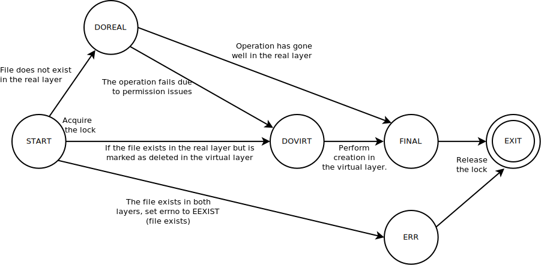
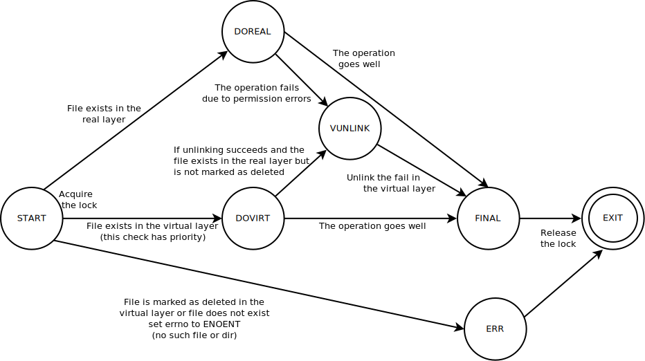

`vufs`: VUOS virtual filesystems
====

## Overview                                                                     
The Virtual File System (VUFS) provides a mechanism for virtualizing file system operations within the VUOS project. It implements a layered approach to managing file operations based on the mounting mode such as **binding**, **merging**, **copy-on-write (COW)**, and **minimal COW** through an use of automata to manage the various states of operations.  
For more information about the differences of the mounting modes and how they work check out [the tutorial](../tutorials/vufs.md).

---  

## Key Components

### Core Structure and Inline Support Functions 
- **`struct vufs_t`**: Represents the state of a virtual file system.
  - Includes file descriptors (`vdirfd`, `rdirfd`, `ddirfd`), mutex for thread safety, and flags.
- **`vufs_lock` and `vufs_unlock`**: Thread safety mechanisms wrapping `pthread_mutex` (semaphore based) operations.

---

### Virtual File Existence and Deletion Functions
- **`vufs_vexist`**: Checks if a file exists in the virtual file system (`vdirfd`).
- **`vufs_rexist`**: Checks if a file exists in the real file system (`rdirfd`).
- **`vufs_vdeleted`**: Determines if a file has been deleted or is inaccessible in the virtual layer.

---

### File System Actions States
File system actions are managed with a state machines with the following states:
- **`VUFSA_START`**: Initial state (usually acquires the lock).
- **`VUFSA_DOVIRT`**: Perform operations in the virtual layer.
- **`VUFSA_DOREAL`**: Perform operations in the real layer.
- **`VUFSA_DOCOPY`**: Copy file contents for COW.
- **`VUFSA_VUNLINK`**: Virtually unlinks the file.
- **`VUFSA_FINAL`**: Successful termination.
- **`VUFSA_ERR`**: Error state.
- **`VUFSA_EXIT`**: Exit state (usually releases the lock).

#### Action Functions
Each action is encapsulated in a `vufsa_status` function that transitions between states based on input:
1. **Read-only (`vufsa_rdonly`)**:
   - Handles read-only operations.
   - Prefers the virtual layer, falls back to the real layer if file is missing.
2. **Bind (`vufsa_bind`)**:
   - Maps real files directly into the virtual space.
3. **Merge (`vufsa_merge` & `vufsa_merge_unlink`)**:
   - Handles merging operations where virtual files overwrite real files.
   - Prevents modification of virtualized files (read-only enforcement).
4. **Copy-on-Write (`vufsa_cow` and variants)**:
   - Implements copy-on-write semantics:
     - `vufsa_cow_creat`: Ensures new files are created virtually.
     - `vufsa_cow_unlink`: Handles file deletion in the virtual layer.
5. **Minimal Copy-on-Write (`vufsa_mincow` and variants)**:
   - Similar to COW but attempts to minimize unnecessary duplication:
     - `vufsa_mincow_creat`: Prefers virtual files for creation.
     - `vufsa_mincow_unlink`: Manages unlinking in a mixed virtual-real setup.

---

### Selector Function: `vufsa_select`
The `vufsa_select` function determines the appropriate action for a file operation based on the virtual file system type and operation flags.

#### Supported File System Types
1. **Binding (`VUFS_BIND`)**:
   - Direct mapping between virtual and real file systems.
2. **Merging (`VUFS_MERGE`)**:
   - Virtual files overlay real files with read-only semantics.
3. **Copy-on-Write (`VUFS_COW`)**:
   - Virtual layer modifications are isolated via copying.
4. **Minimal Copy-on-Write (`VUFS_MINCOW`)**:
   - Optimization of COW to avoid unnecessary duplication.

#### Workflow
- Checks the file system type (`vufs->flags`).
- Matches the operation flags (e.g., `O_RDONLY`, `O_CREAT | O_EXCL`) to decide on the action and returns the correct automata for the situation.

---

## Error Codes
The implementation utilizes standard `errno` values for error reporting:
- `ENOENT`: File not found.
- `EROFS`: Read-only file system error.
- `EEXIST`: File already exists.
- `EACCES`, `EPERM`: Permission errors.  

For more details check the arm generic error documentation.

---

## Automata Descriptions

### VUFS Automata Documentation  

This section describes the automata managing file system operations in the Virtual File System (VUFS). Each automaton follows a consistent format, listing actions, conditions, and transitions between states.

---

### **1. `vufsa_rdonly`**  
**Purpose**: Handles read-only file operations, preferring the virtual layer and falling back to the real layer if needed.

#### **States and Transitions**  
1. **`VUFSA_START`**:  
   - **Action**: Locks the virtual file system (`vufs`).  
   - **Next**: `VUFSA_DOVIRT`.  

2. **`VUFSA_DOVIRT`**:  
   - **Conditions**:  
     - **File Not Found (`errno == ENOENT`)**:  
       - **File Deleted (`vufs_vdeleted`)** → `VUFSA_FINAL` (`errno = ENOENT`).  
       - **File Not Deleted** → `VUFSA_DOREAL`.  
     - **File Exists** → `VUFSA_FINAL`.  

3. **`VUFSA_DOREAL`**:  
   - **Action**: Tries accessing the file in the real file system.  
   - **Next**: `VUFSA_FINAL`.  

4. **`VUFSA_FINAL` / `VUFSA_ERR`**:  
   - **Action**: Unlocks the file system and finalizes the operation.  
   - **Next**: `VUFSA_EXIT`.  

---

### **2. `vufsa_bind`**  
**Purpose**: Maps real files directly into the virtual space.

#### **States and Transitions**  
1. **`VUFSA_START`**:  
   - **Next**: `VUFSA_DOVIRT`.  

2. **`VUFSA_DOVIRT` / `VUFSA_ERR`**:  
   - **Next**: `VUFSA_EXIT`.  

---

### **3. `vufsa_merge`**  
**Purpose**: Manages merging by overlaying the virtual layer on top of the real file system with read-only semantics.

#### **States and Transitions**  
1. **`VUFSA_START`**:  
   - **Action**: Locks `vufs`.  
   - **Conditions**:  
     - **File Exists in Virtual Layer or Deleted (`vufs_vexist` / `vufs_vdeleted`)**:  
       - Sets `errno = EROFS`.  
       - **Next**: `VUFSA_ERR`.  
     - **File Not Found** → `VUFSA_DOREAL`.  

2. **`VUFSA_DOREAL`**:  
   - **Action**: Operates on the real file system.  
   - **Next**: `VUFSA_FINAL`.  

3. **`VUFSA_FINAL` / `VUFSA_ERR`**:  
   - **Action**: Unlocks `vufs`.  
   - **Next**: `VUFSA_EXIT`.  

---

### **4. `vufsa_merge_unlink`**  
**Purpose**: Handles unlinking files in the merging setup.

#### **States and Transitions**  
1. **`VUFSA_START`**:  
   - **Action**: Locks `vufs`.  
   - **Conditions**:  
     - **File Exists in Virtual Layer (`vufs_vexist`)** → `VUFSA_ERR` (`errno = EROFS`).  
     - **File Deleted (`vufs_vdeleted`)** → `VUFSA_ERR` (`errno = ENOENT`).  
     - **Otherwise** → `VUFSA_DOREAL`.  

2. **`VUFSA_DOREAL`**:  
   - **Next**: `VUFSA_FINAL`.  

3. **`VUFSA_FINAL` / `VUFSA_ERR`**:  
   - **Action**: Unlocks `vufs`.  
   - **Next**: `VUFSA_EXIT`.  

---

### **5. `vufsa_cow`**  
**Purpose**: Implements Copy-on-Write (COW) operations.

#### **States and Transitions**  
1. **`VUFSA_START`**:  
   - **Action**: Locks `vufs`.  
   - **Conditions**:  
     - **File Exists in Virtual Layer or Deleted (`vufs_vexist` / `vufs_vdeleted`)** → `VUFSA_DOVIRT`.  
     - **Otherwise** → `VUFSA_DOCOPY`.  

2. **`VUFSA_DOCOPY`**:  
   - **Next**: `VUFSA_DOVIRT`.  

3. **`VUFSA_DOVIRT`**:  
   - **Next**: `VUFSA_FINAL`.  

4. **`VUFSA_FINAL` / `VUFSA_ERR`**:  
   - **Action**: Unlocks `vufs`.  
   - **Next**: `VUFSA_EXIT`.  

---

### **6. `vufsa_cow_creat`**  
**Purpose**: Handles file creation under COW semantics.  

#### **States and Transitions**  
1. **`VUFSA_START`**:  
   - **Action**: Locks `vufs`.  
   - **Conditions**:  
     - **File Exists in Real Layer and Not Deleted (`vufs_rexist`)** → `VUFSA_ERR` (`errno = EEXIST`).  
     - **Otherwise** → `VUFSA_DOVIRT`.  

2. **`VUFSA_DOVIRT`**:  
   - **Next**: `VUFSA_FINAL`.  

3. **`VUFSA_FINAL` / `VUFSA_ERR`**:  
   - **Action**: Unlocks `vufs`.  
   - **Next**: `VUFSA_EXIT`.  

---

### **7. `vufsa_cow_unlink`**  
**Purpose**: Manages file deletion under COW semantics.

#### **States and Transitions**  
1. **`VUFSA_START`**:  
   - **Action**: Locks `vufs`.  
   - **Conditions**:  
     - **File Exists in Virtual Layer (`vufs_vexist`)** → `VUFSA_DOVIRT`.  
     - **File Deleted (`vufs_vdeleted`)** → `VUFSA_ERR` (`errno = ENOENT`).  
     - **File Exists in Real Layer (`vufs_rexist`)** → `VUFSA_VUNLINK`.  
     - **Otherwise** → `VUFSA_ERR` (`errno = ENOENT`).  

2. **`VUFSA_DOVIRT`**:  
   - **Next**:  
     - **File Exists in Real Layer and Not Deleted (`vufs_rexist`)** → `VUFSA_VUNLINK`.  
     - **Otherwise** → `VUFSA_FINAL`.  

3. **`VUFSA_VUNLINK`**:  
   - **Next**: `VUFSA_FINAL`.  

4. **`VUFSA_FINAL` / `VUFSA_ERR`**:  
   - **Action**: Unlocks `vufs`.  
   - **Next**: `VUFSA_EXIT`.  

---

### **8. `vufsa_mincow`**  
**Purpose**: Optimizes COW operations by reducing unnecessary duplication.

#### **States and Transitions**  
1. **`VUFSA_START`**:  
   - **Action**: Locks `vufs`.  
   - **Conditions**:  
     - **File Exists in Virtual Layer or Deleted (`vufs_vexist` / `vufs_vdeleted`)** → `VUFSA_DOVIRT`.  
     - **Otherwise** → `VUFSA_DOREAL`.  

2. **`VUFSA_DOREAL`**:  
   - **Conditions**:  
     - **Access Denied (`errno == EACCES || errno == EPERM`)** → `VUFSA_DOCOPY`.  
     - **Otherwise** → `VUFSA_FINAL`.  

3. **`VUFSA_DOCOPY`**:  
   - **Next**: `VUFSA_DOVIRT`.  

4. **`VUFSA_DOVIRT`**:  
   - **Next**: `VUFSA_FINAL`.  

5. **`VUFSA_FINAL` / `VUFSA_ERR`**:  
   - **Action**: Unlocks `vufs`.  
   - **Next**: `VUFSA_EXIT`.  

---

The implementations of `vufsa_mincow_creat` and `vufsa_mincow_unlink` follow a state-driven approach, ensuring correctness and consistency. Here's an analysis of each function's behavior:

---

### **9. `vufsa_mincow_creat`**
**Purpose**: Handles file creation in minimal COW mode.  

#### **State and Transitions**:  
- **`VUFSA_START`**:  
  - Locks `vufs`.
  - If the file exists in the real layer (`vufs_rexist`):  
    - If it's marked as deleted (`vufs_vdeleted`), proceed to `VUFSA_DOVIRT`.
    - Otherwise, set `errno = EEXIST` and go to `VUFSA_ERR`.
  - If the file doesn't exist, proceed to `VUFSA_DOREAL`.  

- **`VUFSA_DOREAL`**:  
  - If file creation in the real layer fails with `EACCES`, `ENOENT`, or `EPERM`, fallback to `VUFSA_DOVIRT`.
  - Otherwise, proceed to `VUFSA_FINAL`.  

- **`VUFSA_DOVIRT`**:  
  - Finalize the process successfully (`VUFSA_FINAL`).  

- **`VUFSA_FINAL` / `VUFSA_ERR`**:  
  - Unlock `vufs` and exit (`VUFSA_EXIT`).  

---

### **10. `vufsa_mincow_unlink`**  
**Purpose**: Manages file deletion in minimal COW mode.  

#### **State and Transitions**:  
- **`VUFSA_START`**:  
  - Locks `vufs`.  
  - If the file exists in the virtual layer (`vufs_vexist`), proceed to `VUFSA_DOVIRT`.  
  - If the file is marked as deleted (`vufs_vdeleted`), set `errno = ENOENT` and move to `VUFSA_ERR`.  
  - If the file exists in the real layer (`vufs_rexist`), proceed to `VUFSA_DOREAL`.  
  - If no conditions match, set `errno = ENOENT` and go to `VUFSA_ERR`.  

- **`VUFSA_DOREAL`**:  
  - If deletion in the real layer fails with `EACCES` or `EPERM`, attempt a virtual unlink (`VUFSA_VUNLINK`).  
  - Otherwise, proceed to `VUFSA_FINAL`.  

- **`VUFSA_DOVIRT`**:  
  - If virtual deletion succeeds, check if the file still exists in the real layer.  
  - If it does and isn't marked as deleted, proceed to `VUFSA_VUNLINK`.  
  - Otherwise, finalize the process (`VUFSA_FINAL`).  

- **`VUFSA_VUNLINK`**:  
  - Finalize the process (`VUFSA_FINAL`).  

- **`VUFSA_FINAL` / `VUFSA_ERR`**:  
  - Unlock `vufs` and exit (`VUFSA_EXIT`).  

